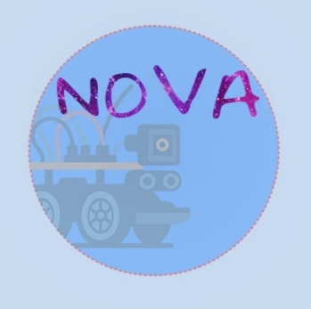

# Nova Team – WRO Future Engineers 2025

## Table of Contents
- [About Us](#about-us)
- [Power and Sense Management](#power-and-sense-management)
- [Obstacle Management](#obstacle-management)
- [Engineering Factor](#engineering-factor)
- [Hardware](#hardware)
- [Software](#software)
- [Experience and Acquired Expertise](#experience-and-acquired-expertise)
- [Special Thanks](#special-thanks)
- [Conclusion and Future Vision](#conclusion-and-future-vision)

---

## About Us

We are a team of three members:

### Amr Younis
A fifteen-year-old Palestinian.  
Instagram: [amr.younis04](https://www.instagram.com/amr.younis04)

### Mohammad Abu Laban
A fifteen-year-old Palestinian.  
Instagram: [mo_abu_lab](https://www.instagram.com/mo_abu_lab)

### Ibrahim Mummar
A fifteen-year-old Palestinian.  
Instagram: [lbrameem_mum](https://www.instagram.com/lbrameem_mum)

We are pleased to introduce our project, which involves building and programming a robot capable of traversing a specific path. This path consists of a white carpet with two lines in each corner, as well as an orange line and a blue line. The carpet measures three meters long and three meters wide, surrounded by a 10-cm-high black wooden wall, with a 10-cm-high square black wooden wall in the middle of the carpet.

---
## Power and Sense Management

We used a 12.6-volt, 6A rechargeable lithium battery. It’s a medium-weight battery with large capacity, sufficient for all components. We distributed the power correctly so that no single component consumes more than its share.

---

## Obstacle Management

The robot deals with obstacles using ultrasonic sensors and a camera.

Ultrasonic technology measures the distance between the obstacle and the robot, enabling it to adjust its direction. It works by sending out sound waves and measuring their bounce.

The camera recognizes colors and sends a signal to the Raspberry Pi. For example, when detecting red, the robot reacts according to the instructions we programmed.

---

## Engineering Factor

We started with a ready-made kit and modified it to suit our task. For example, we added additional layers to contain all the parts and ensured balanced weight distribution, placing the battery in the middle to prevent tilting.

<h1 id="hardware" style="font-family:Verdana; color:blue;">Hardware</h1>

<h2 style="font-family:Verdana; color:blue;">1- The Robot</h2>

We modified a ready-made kit by adding one acrylic layer and two plastic layers, giving us four in total:

<ul style="font-family:Verdana;">
  <li>Ground layer: DC motor and servo motor</li>
  <li>Second layer: Battery</li>
  <li>Third layer: Power button and power regulation circuit</li>
  <li>Fourth layer: Raspberry Pi, gyroscope, three ultrasonic sensors, camera and motor driver</li>
</ul>

  
All connected with jumper wires.

<!-- الصور على اليمين -->
<h2 style="font-family:Verdana; color:blue;">2- Kit Used</h2>

MG996 car model servo and DC motor 
Available in Palestine and suitable for our task 
Cost: $95 <a href="https://a.aliexpress.com/_c3kFLPlv" target="_blank">AliExpress</a>

<h2 style="font-family:Verdana; color:blue;">3- Microcontroller</h2>

Raspberry Pi 4 8GB RAM 
Fast CPU, Python support, and available locally 
Cost: $92 <a href="https://www.aliexpress.com/item/1005001866255360.html" target="_blank">AliExpress</a>

<h2 style="font-family:Verdana; color:blue;">4- Battery</h2>

12.6V, 6A lithium battery 
High voltage & capacity, adjustable output

<h2 style="font-family:Verdana; color:blue;">5- DC Power Converter</h2>

XL4015 (32V → 1.25V adjustable) 
Easy to install 
Cost: $1 <a href="https://www.aliexpress.com/item/32824713057.html" target="_blank">AliExpress</a>

<h2 style="font-family:Verdana; color:blue;">6- Ultrasonic Sensors</h2>

3 × HC-SR04 
Voltage: 3.3 to 5V 
Range: 2cm to 400cm 
Cost: $1 each <a href="https://a.aliexpress.com/_c3gyMqNp" target="_blank">AliExpress</a>

<h2 style="font-family:Verdana; color:blue;">7- Motor Driver</h2>

L298N motor driver 
Sufficient for our motors 
Cost: $1.50 <a href="https://a.aliexpress.com/_c4BxRCor" target="_blank">AliExpress</a>

<h2 style="font-family:Verdana; color:blue;">8- Gyroscope</h2>

MPU-6050 gyroscope and accelerometer 
Small, efficient, available 
Cost: $1.60 <a href="https://a.aliexpress.com/_c4rTkJNN" target="_blank">AliExpress</a>

<h2 style="font-family:Verdana; color:blue;">9- Camera</h2>

Ultra-wide USB camera 
Better than Pi camera & easier to program

<h2 style="font-family:Verdana; color:blue;">10- Jumper Wires</h2>

Male to male, male to female, female to female 
Strong, reusable, Raspberry Pi compatible 
Cost: $3 <a href="https://www.aliexpress.com/item/32722114256.html" target="_blank">AliExpress</a>

<h2 style="font-family:Verdana; color:blue;">11- On/Off Button</h2>

Regular on/off switch 
Inexpensive and easy to install 
Cost: $5 <a href="https://a.aliexpress.com/_c3wrhjtl" target="_blank">AliExpress</a>

---

## Software

We programmed the robot using Python 3 on Linux (Raspberry Pi OS). Python was chosen for its large library support and flexibility. Libraries such as OpenCV were used for image processing, while GPIO libraries allowed us to control motors and sensors.

---

## Experience and Acquired Expertise

This project gave us valuable skills:

- Teamwork and decision-making
- Problem-solving in programming and hardware
- Overcoming obstacles in robotics for the first time

We also gained technical expertise:

- Computer vision and sensor integration
- Open-source robotics design
- Balancing power, weight, and stability in engineering design

---

## Special Thanks

Engineer Wissam Nasriyah – for guiding us from zero to hero.  
Engineer Mohammed Dababseh and Supervisor Abeer Mosa – for their valuable support.

---

## Conclusion and Future Vision

This project was not just about building a robot — it was about proving what motivated students can achieve with creativity, persistence, and teamwork.

Our next steps will focus on turning our passion for robotics into solutions that can help people in everyday life. From intelligent navigation systems to practical automation, we aim to expand the boundaries of what we can design and build.

**Nova Team – Building today, imagining tomorrow**
